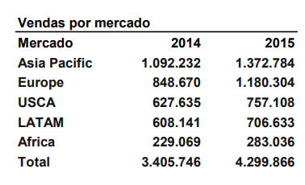

# **📊 Do Planejamento à Análise**
*Uma aplicação prática de storytelling e visualização de dados*

### **1. Introdução**

Este projeto apresenta as etapas e resultados da análise de vendas entre os anos de 2014 e 2015. O foco foi aplicar conceitos de visualização e interpretação de dados, gerando insights relevantes sobre o desempenho global da empresa.

### **2. Objetivos**

- Definir um **público-alvo**;
- Construir uma **narrativa clara** com começo, meio e fim;
- Usar a visualização como **ferramenta de comunicação**, não apenas de exibição.

### **3. Planejamento da Análise**

Antes de qualquer manipulação de dados, foram definidas **perguntas-chave** que guiariam a análise:

- Qual mercado teve o maior crescimento em 2015?
- Quais categorias impulsionaram esse crescimento?
- Há mercados ou categorias com potencial subexplorado?
- Como equilibrar investimentos entre mercados maduros e emergentes?

### **4. Coleta e Limpeza de Dados**

**Fontes de dados**:

- Tabelas de vendas por mercado (2014 e 2015);
- Tabelas de vendas por categoria para os mercados *Asia Pacific* e *Europe*.

**Processo de limpeza**:

- Verificação de valores ausentes: nenhum identificado;
- Padronização de nomes de mercados e categorias (ex: “Office Supplie” → “Office Supplies”);
- Consolidação de totais para validação da consistência.

### **5. Exploração e Montagem da Análise**

A análise exploratória incluiu:

- Cálculo de **taxas de crescimento** por mercado e categoria;
- Comparação de **volumes absolutos** vs. **crescimento relativo**;
- Identificação de **outliers**.

**Métricas escolhidas**:

- Vendas em valor absoluto (para dimensionamento);
- Variação percentual (para dinamismo);
- Participação relativa (para contexto).

### **6. Construção dos Gráficos**

Foram utilizados principalmente **gráficos de barras agrupadas** e **gráficos de barras de crescimento**, com as seguintes justificativas:

| **Gráfico** | **Objetivo** | **Justificativa** |
| --- | --- | --- |
| Barras agrupadas (2014 vs 2015) | Comparar volumes entre anos | Mostra evolução direta e facilita a comparação visual |
| Barras de crescimento (%) | Destacar desempenho relativo | Elimina viés de tamanho de mercado e foca na taxa |

**Técnicas de visualização aplicadas**:

- **Cores**: uso de tons distintos mas harmônicos (escalas de cinzas), com contraste suficiente;
- **Simplificação**: remoção de bordas, linhas de grade e legendas redundantes;
- **Hierarquia visual**: títulos claros e diretos, uso de anotações para destacar insights.

### **7. Criação do Storytelling**

A narrativa foi estruturada em três atos:

#### **Ato 1 – Contexto e Panorama Global**

- Apresentação do crescimento global;
- Gráfico de volumes por mercado para mostrar quem são os líderes.

#### **Ato 2 – Detalhamento por Mercado e Categoria**

- Foco nos dois mercados mais relevantes;
- Gráficos de categoria para mostrar **o que** impulsionou o crescimento.

#### **Ato 3 – Insights e Chamada à Ação**

- Destaque para oportunidades específicas;
- Recomendações por mercado e categorias.

### **8. Reflexão sobre o processo**:

- A abordagem orientada por perguntas e narrativa tornou a análise mais **focada e comunicativa**;
- A simplificação visual aumentou a **compreensão e o impacto** dos resultados.
- Dados sem narrativa são apenas números;
- O design visual deve servir à clareza, não à decoração;
- Uma boa análise é aquela que **leva a uma decisão**.

---  

# Análise de Vendas (2014 – 2015)

Este projeto teve como tema central a **análise comparativa de vendas por mercado e categoria entre os anos de 2014 e 2015**. O contexto era o de uma empresa global em expansão, buscando compreender seu desempenho recente para orientar decisões estratégicas.

O **objetivo principal** foi identificar padrões de crescimento, oportunidades regionais e comportamentos por categoria, transformando dados brutos em **insights acionáveis**.

## **Base de Dados**

**Fontes de Dados:**

- Tabelas de vendas por mercado (2014-2015)
    
    
    

- Tabelas de vendas por categoria para mercados selecionados
    
    
    
    

## **Análises Realizadas**

- **Performance Consolidada:** O crescimento expressivo indica saúde operacional e um ano de forte performance

- **Insight:** Os mercados consolidados (Asia Pacific e Europa) representam a maior parte do faturamento, enquanto mercados como África e LATAM ainda têm potencial a ser explorado.

- **Insight:** A Europa foi a que mais cresceu, mostrando um mercado em forte expansão. Já o LATAM teve o menor crescimento, indicando possíveis barreiras ou saturação.

- **Technology** teve o maior volume, mas **Office Supplies** teve o maior crescimento: **+36%**
- Isso sugere uma **nova demanda em Office Supplies**, que pode representar uma oportunidade de investimento.

- **Technology** lidera em volume e crescimento: **+47%**
- **Furniture** cresceu mais que **Office Supplies**, indicando uma possível mudança no comportamento do consumidor europeu.

## **Principais Insights**

**Mercado Europeu: O Grande Destaque**

- Maior taxa de crescimento (+39%)
- Crescimento robusto em todas as categorias
- Mercado em expansão acelerada, merecendo investimentos prioritários
- **Technology** com crescimento explosivo (+47%), ampliar estoque de tecnologia e garantir reposição rápida
- **Furniture** superando Office Supplies, revisar mix de produtos

 **Asia Pacific: Líder Consolidado**

- Maior volume total de vendas (1,4M)
- Crescimento estável (+20%)
- Mercado maduro, porém com oportunidades específicas por categoria
- **Office Supplies** com crescimento acelerado (+36%), aumentar capacidade de armazenamento, demanda aquecida, possivelmente por expansão de negóciose variedade.
- **Technology** com crescimento moderado, manter políticas de estoque conservadoras

**Comportamento de Crescimento Global**

- Europa e África mostram maior dinamismo
- LATAM requer atenção especial (menor crescimento), desenvolver estratégia especial com foco em categorias específicas
- Necessidade de estratégias regionalizadas
- Propor metas por Mercados para 2016
- Propor metas por categorias em cada Mercado para 2016

## **Conclusão**

Este exercício prático demonstrou todo o ciclo de análise de dados, desde a organização das informações brutas até a geração de insights acionáveis e proposição de metas futuras.

**Principais Aprendizados:**

- A importância da análise tanto por volume quanto por taxa de crescimento
- A necessidade de olhar além dos números absolutos
- A valor de entender o comportamento por categoria dentro de cada mercado
- A capacidade de traduzir dados em decisões estratégicas

